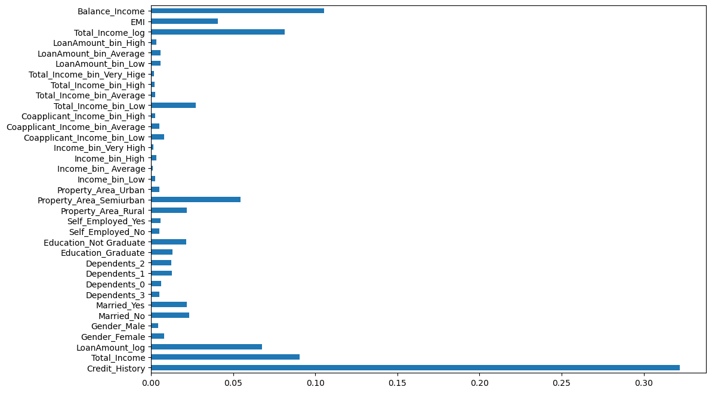

#  LOAN ELIGIBILITY PREDICTION - PYTHON

#### This Project entails in-detail loan prediction where cutting-edge analytics meets financial foresight! This project harnesses the power of data to predict the likelihood of loan approval, revolutionizing the lending industry by minimizing risks and optimizing decision-making processes.
----
              
----

## Introduction:

I aim to develop a predictive model utilizing machine learning algorithms to analyze key user data such as gender, age, number of dependents, loan amount requested, loan term length, credit history, income, and co-applicant income to empower lending institutions to make more informed and accurate decisions regarding loan approvals in an efficient manner. The goal is to create a classification model using these key attributes as inputs that can predict with high precision whether a given loan application should be approved. The model aims to improve loan approval accuracy and efficiency using predictive analytics on key applicant data.

## Problem Statement:

Homestead Loans Inc. is a large financial services company providing home loans and mortgages to millions of customers across urban, semi-urban, and rural regions. When customers apply for a home loan, Homestead Loans validates their eligibility manually before approving or denying the loan.

To scale operations and provide quicker home loan decisions, Homestead Loans wants to automate the loan eligibility analysis based on the application details submitted by the borrower. These application details include personal information like gender, marital status, education level, number of financial dependents, and annual income amount as well as details directly related to the requested loan including loan amount, credit history, collateral details, etc.

The loan automation system uses machine learning algorithms to analyze all application information submitted by the borrower. It will then accurately segment customers into groups eligible for loan approval. Key customer segments who are more likely to repay the home loan are identified using predictive analytics. Recommendations are generated on the ideal loan amount, tenure, and rate to offer the borrower. As well as assess overall eligibility before releasing the final loan offer.

By using automated AI-based algorithms for real-time loan eligibility, Homestead Loans aims to provide quicker decisions to borrowers, scale loan approvals, tap underserved customer segments, and significantly grow its overall loan book. The algorithms will optimize loan offers and better manage lending risk for the long term by predictive segmentation of potential defaulters.

## Data Pipeline

The loan application data was sourced from the Datahack Platform containing past application records. Using Pandas, the data was cleaned, processed, and structured into an analyzable format. Exploratory analysis was conducted using Seaborn visualizations to understand relationships. 

## Model Development

Using Scikit-Learn, models were developed to classify applicants as eligible or not eligible for loans. The algorithms evaluated were Decision Tree, Logistic Regression, Random Forest Classifier, and XGBoost Classifier. Standard scalar transformation and one-hot encoding were applied as data preprocessing steps.

Each model was evaluated using stratified K-Fold cross-validation with the area under the ROC curve as the primary metric. Feature importance analysis of the Random Forest model showed that credit history, Total income, and EMI were top predictors.

----
              
----

## Conclusion

In conclusion, Logistic regression can effectively determine home loan eligibility with 79% test accuracy followed by random forest which is close to 78% test accuracy. By operationalizing this system, Homestead Loans can automate real-time loan decisions and significantly scale its loan approval process.

